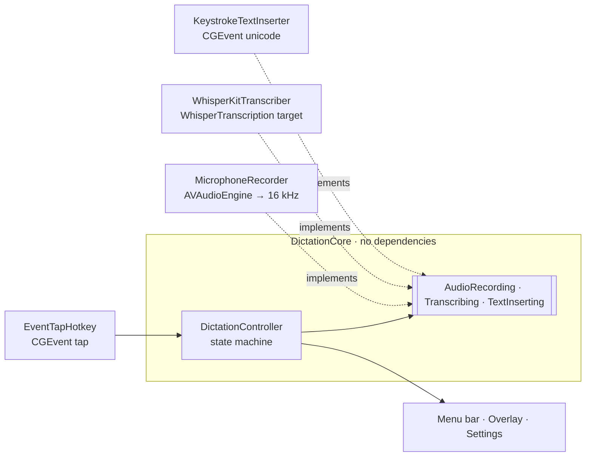

# Dictator

Minimal, local-only dictation for macOS. Press a shortcut, talk, and the text is typed into
whatever field has focus. Transcription runs on-device with **Whisper Large v3 Turbo** (WhisperKit
Core ML), bundled inside the app.

- **Tap** the shortcut to start, tap again to stop.
- **Hold** the shortcut to talk, release to finish.
- Default shortcut: **⌃⌥D**. Change it in Settings (menu bar icon → Settings…): click the
  shortcut, hold any key or combination and let go. Anything works: bare keys, several keys at
  once, a single modifier (e.g. Right ⌥), fn or Caps Lock. A keyboard drawing shows the shortcut
  and lights up keys live while recording.

- **Undo Last Dictation** from the menu (or an optional shortcut) removes exactly what was just
  typed, as long as you haven't typed or clicked since.
- Consecutive dictations are spaced and capitalised to continue the sentence.
- **Language:** Automatic, Dansk or English (Settings → Model).
- Optional: open at login, keep the microphone ready (catches the first word), daily update check.

That's the whole feature set. See [CHANGELOG.md](CHANGELOG.md) for what changed in each version.

## Build

Requires macOS 15+, Apple silicon, Xcode 26+ (Swift 6.2+).

```sh
scripts/build-app.sh            # fetches + verifies the model, builds, signs → build/Dictator.app
open build/Dictator.app
```

First launch: grant **Microphone**, **Input Monitoring** (needed to detect the shortcut) and
**Accessibility** (needed to type into other apps). The
first model load specialises Core ML for your chip and can take a few minutes; later launches take
about a second.

For a stable signature (so macOS remembers permissions across rebuilds), sign with your own
identity: `SIGN_IDENTITY="Apple Development: …" scripts/build-app.sh`. Ad-hoc builds (the default)
must be re-granted Accessibility after each rebuild.

## Test

```sh
swift test
```

`WhisperTranscriptionTests` runs a real end-to-end transcription (speech synthesised with `say`)
when `Model/` exists; run `scripts/fetch-model.sh` first.

## CI / Release

- **Quality gate** (`.github/workflows/quality-gate.yml`): every push to any branch resolves
  dependencies against `Package.resolved`, builds release, and runs `swift test` (the model-based
  end-to-end test is skipped).
- **Release** (`.github/workflows/release.yml`): publishing a GitHub release builds
  `Dictator.app` (version taken from the tag, `v` prefix stripped) and attaches
  `Dictator-<tag>-macos-arm64.zip` plus its `.sha256`. Builds are ad-hoc signed and not notarised,
  so on first launch users must allow it via System Settings → Privacy & Security → Open Anyway
  (or `xattr -dr com.apple.quarantine Dictator.app`).

## Architecture



| Target | Responsibility |
| --- | --- |
| `DictationCore` | Pure logic: tap/hold state machine, shortcut chord model and matcher, transcript cleanup, the punctuation prompt given to Whisper, text chunking. Defines the ports. Fully unit-tested with fakes. |
| `WhisperTranscription` | The **only** code that imports WhisperKit. Swap the model/engine here. |
| `Dictator` | macOS adapters (hotkey, mic, typing, permissions) and SwiftUI/AppKit UI. Composition root is `AppModel`. |

## Security

- **Dictation is offline.** Audio and text never leave the Mac. WhisperKit is configured with
  `download: false` and the tokenizer is bundled; the transcriber refuses to load if any required
  file is missing (WhisperKit would otherwise fall back to downloading).
- **One network request, and you can turn it off.** Once a day, `UpdateChecker` (the only network
  code in the app) asks GitHub's public releases API whether a newer version exists, and the menu
  offers to open the release page. Nothing is downloaded or installed, no token or user data is
  sent (ephemeral session), and Settings → General → *Check for updates daily* turns it off.
- **Minimal entitlements:** App Sandbox + microphone + outgoing network connections (for the
  update check only). Hardened runtime.
- **No clipboard.** Text is typed via synthetic Unicode key events, so dictations never pass
  through the pasteboard (clipboard managers, other apps) and your clipboard is untouched.
- **Output is sanitised:** single line only (newlines/tabs become spaces, so dictation can't press
  Enter and submit a form) and control characters are stripped.
- **Audio stays in memory** for one dictation only, capped at 10 minutes, never written to disk.
  Transcripts are never logged. If typing fails, that one transcript is kept in memory (never on
  disk) so it can be typed again from the menu, until it's discarded or the next dictation succeeds.
- **Hotkey via a CoreGraphics event tap** so any key combination can be the shortcut. This needs
  Input Monitoring: the tap sees every key event, but each is only compared in memory against the
  shortcut and immediately dropped; nothing is stored, logged or published. Dictator's own typed
  text is ignored. The shortcut's non-modifier keys are withheld from other apps when macOS allows
  an active tap (otherwise they pass through, and Settings warns if the shortcut would type into
  the focused app). Modifier keys, fn and Caps Lock always reach other
  apps (Caps Lock still toggles, and fn may still open the emoji picker depending on System
  Settings). Like all event taps, it can't see keys while a password field has secure input on.
- **Supply chain:** one third-party dependency, WhisperKit, pinned to an exact version
  (`Package.resolved` is committed). Model files are pinned to immutable Hugging Face commits and
  verified by SHA-256 (`scripts/model-manifest.txt`); LFS hashes were cross-checked against
  Hugging Face's published hashes.

### Updating dependencies

- **WhisperKit:** bump `exact:` in `Package.swift`, review the upstream diff, `swift package resolve`,
  run `swift test`.
- **Model:** regenerate `scripts/model-manifest.txt` against a new pinned commit, then delete
  `Model/` and run `scripts/fetch-model.sh`.
